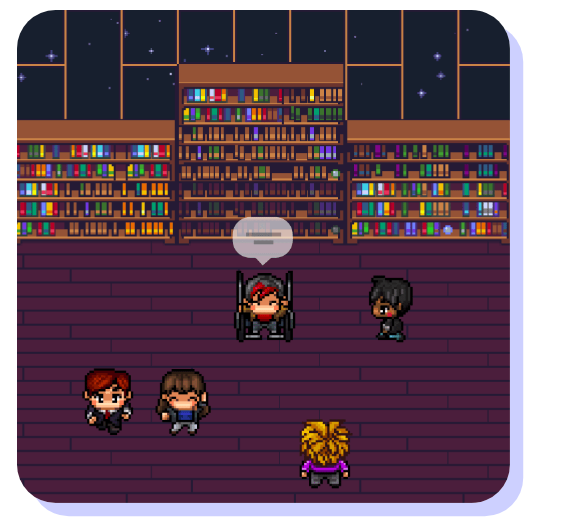

# Space FS

### Abstract:

Space FS is a blockchain first platform for hosting live audio/music/voice events with the aim to build audio metaverse.

### Inspiration:

In 2020/2021 we have seen rise of auido only social platfrom like Clubhouse, Twitter Space, Spotify Greeroom,etc.
In addition, platforms like https://www.gather.town/ & https://hello.vrchat.com/ reshapes how people can gather online. Idea of Space-FS is to make event gathering like **gather.town** for audio events. Here is how gather meetup looks like:

( idea is to make event gathering like **gather.town** as shown above )  

### Implementation:

Upon Building such platform in the Web3 enables us to add the incentives mechanism to both parties specially for the independent artist. When an artist hosts the events and supporters joins the game theroy can be:

**a) Artist** 
They reach out wide audience round the globe & option to get paid by the supporters joining the room from the NFT ticket sales.

**b) Supporter** 
For supporters we can add reward system based on NFT. for example: a supporter attending 5 events gets a certain NFT that allows him to have:

 <li>Discounts for upcomming events</li> 
 <li>Special spots on the events</li> 
 <li>The NFT can be also be sold later</li>
 <li>many more economic models can be adopted here</li>
